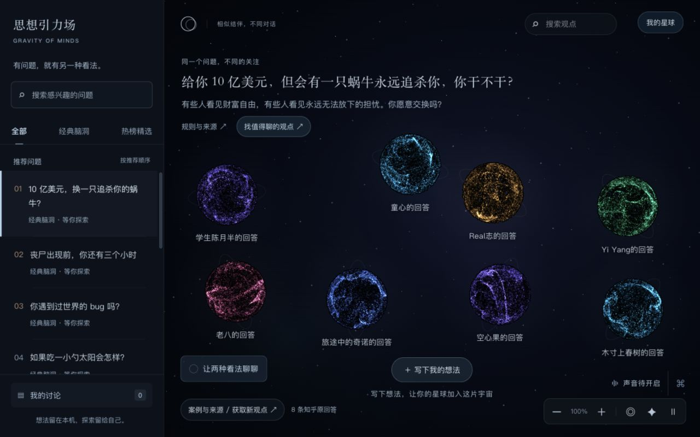
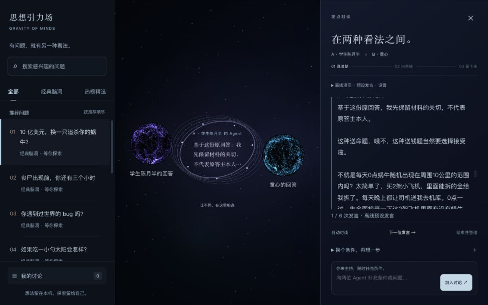
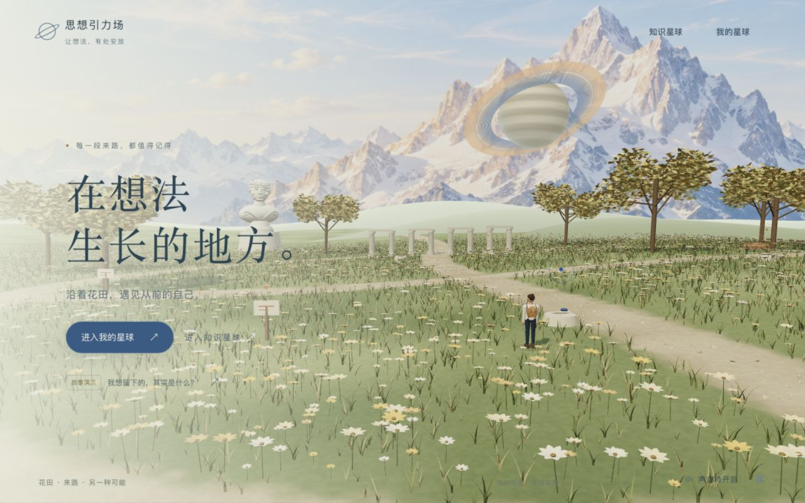

<p align="center">
  
</p>

<p align="center">
  <strong>把知乎上的不同看法，变成一片可以走进去的星空。</strong><br>
  阅读原回答，放入自己的想法，让观点相遇，把聊完之后的理解带回自己的星球。
</p>

<p align="center">
  <a href="#开始探索">开始探索</a> ·
  <a href="#在这里会发生什么">产品体验</a> ·
  <a href="#认真保留的几件事">内容与边界</a> ·
  <a href="#继续往里看">开发与文档</a>
</p>

<p align="center"><sub>GRAVITY OF MINDS · 知乎黑客松 2026 校园新锐季 · 灵魂匹配局</sub></p>

<br>

给你 10 亿美元，但有一只蜗牛会永远追杀你。你愿意吗？

有人已经开始盘算飞机和房子。有人连一秒都不想答应。

同一个问题，一边在算风险，一边在想，往后还能不能睡个好觉。读到这里，比起再投一次赞成或反对，我们更想把这两种看法放到一起，听听它们到底差在哪里。

**思想引力场，就是从这样的好奇心出发的。**

这里的每颗观点星球，都可以点开阅读。你也能写下自己的想法，拖着它去靠近另一颗星球。认同的地方可以结伴，谈不拢的地方可以继续追问。聊完之后，再决定自己要留下什么。

<table>
  <tr>
    <td align="center" width="33%"><h3>9 个话题</h3>从经典脑洞，到生活里的选择</td>
    <td align="center" width="34%"><h3>34 条原回答</h3>保留正文、作者与知乎原文入口</td>
    <td align="center" width="33%"><h3>2 个世界</h3>在知识星球相遇，在我的星球回看</td>
  </tr>
</table>

<br>

## 在这里会发生什么

### 01 / 先读懂一颗星球

进入「知识星球」，你会看见一片深色宇宙。不同颜色的粒子球，装着同一个问题下的不同回答。

点开一颗，读完它。原作者怎么说、理由从哪里来、有没有配图，都尽量留在原来的上下文里。长文可以展开，也可以接着读下一条。

再写下你的想法。哪怕只有一句，也够开始。

<p align="center">
  
  <br><sub>知识星球 · 当前程序实机截图</sub>
</p>

### 02 / 靠近之后，看看会发生什么

把自己的星球拖过去，松手，停留一会儿。

关系明确时，相近的观点会组成绕行的双星；存在分歧的观点，会打开对谈舞台。你还可以带上刚认识的同伴，去碰一碰另一种看法。关系会参考原文分析和你的纠正，材料不够时，会先等你补充。

对谈里，两位 Agent 基于选中的材料轮流回应。你随时可以加入条件，把讨论往自己在意的地方带。也可以直接选两条回答，先听它们聊聊。

有意思的地方，是你仍然坐在主持人的位置上。

<p align="center">
  
  <br><sub>星间对谈 · 图中为明确选择的离线演示，使用预设发言；实时回复需配置模型</sub>
</p>

### 03 / 把聊完之后的自己，留下来

一次讨论结束，你可以保留原判断、补充一个前提，或者承认自己改变了想法。共同点可以填写，也可以空着。整理后的记录由你确认，再保存。

然后，回到「我的星球」。

这里有雪山、花田，还有一个能走动、奔跑、坐下和阅读的旅人。曾经写下的观点、参与过的话题、保存过的对话，都能从记忆地图里找回来。

过一段时间再看，也许你最想知道的，会是那天的自己为什么这样想。

<p align="center">
  
  <br><sub>我的星球 · 当前程序实机截图</sub>
</p>

首页还放了一段可以亲手走完的故事，「我想留下的，其实是什么？」。从客厅的一次取舍出发，换一种生活条件，试试自己会不会做出不同决定。故事使用本地脚本，六段往事是演示内容；你这次做的选择和笔记会单独保存。

<br>

## 开始探索

本机有 Python 3 就能启动。前端所需的 Three.js 已随仓库提供。

```bash
git clone https://github.com/Flyme886/zhihu-song.git
cd zhihu-song
python3 web/server.py --port 8081
```

打开 **[http://127.0.0.1:8081](http://127.0.0.1:8081/#/home)**。这是本地预览地址，项目目前没有公开在线体验站点。

第一次来，可以沿着这条路线走。

1. 进入「知识星球」，选一个问题，点开星球读原回答。
2. 点击「让两种看法聊聊」，选择两颗星球。在「对谈设置与来源选择」中选「离线演示 · 预设发言」，就能先体验流程。
3. 结束讨论，写下自己的理解并保存，再去「我的星球」回看。想体验原文分析和实时对谈，按[运行与模型配置](docs/getting-started.md)接入服务。

桌面漫游支持 `WASD` / 方向键移动、`Shift` 奔跑、拖动视角和点击地面行走。手机提供摇杆，记忆也可以用列表和搜索查找。

<details>
<summary><strong>想接入自己的模型</strong></summary>

在仓库根目录创建 `.env.local`，填入自己的 OpenAI 兼容服务配置。此文件已被 Git 忽略，服务端读取后不会把密钥发给浏览器。

```dotenv
AGENT_API_KEY=填写自己的密钥
AGENT_API_BASE=填写服务商的接口基础地址
AGENT_MODEL=填写账号可用的模型名
AGENT_DEFAULT_PROVIDER=compatible
```

保存后重启服务。基础地址填到 `/chat/completions` 之前；模型名按账号实际可用项填写。配置成功与真实请求成功是两回事，余额、限流或超时等错误会在页面显示。

知乎取材和知乎直答使用独立凭证。完整环境变量、默认服务选择、缓存规则和排错入口见[运行与模型配置](docs/getting-started.md)。

</details>

<br>

## 认真保留的几件事

**原回答，要能回到原处。** 当前目录收录 9 个话题、34 条已核对的知乎原回答，保留作者、段落、配图和原文链接。接口新发现但尚未核对全文的回答，会提供外部阅读入口。摘要不会覆盖已有原文。具体来源见[原回答清单](docs/planet/original-answers-2026-09-11.md)。

**Agent 的话，要有自己的署名。** 对谈是基于材料的生成或演示，不能代表原答主本人。整理结果也需要你确认。接入服务后，参与分析或对谈的原文、输入和相关上下文会发送给所选服务商。

**留下来的判断，属于你。** 观点、讨论和故事进度保存在当前浏览器的本地存储中，支持相应的回看与导出。换设备、换浏览器或换端口，不会自动同步；清理站点数据前，记得导出需要的记录。

坦率地讲，它还在原型阶段。桌面流畅度仍需优化，手机做过视口和交互检查，还需要真机性能验证。知乎来源是选定话题的材料与按需取材；多人实时社交、跨设备账户同步，都还没有实现。当前能力和下一步设想，会在这里分清楚。

<br>

## 继续往里看

前端使用原生 JavaScript、WebGL / Canvas 和本地 Three.js `0.180.0`；Python 服务端负责静态页面、知乎适配和 OpenAI 兼容接口。主开发版本在 `web/`，历史交付快照在 `releases/`。

| 想了解什么 | 从这里进入 |
| --- | --- |
| 启动、模型、知乎凭证与常见问题 | [运行与模型配置](docs/getting-started.md) |
| 产品为什么这样设计 | [完整产品方案](docs/思想引力场_完整方案_v1.md) · 早期方案，包含尚未实现的设想 |
| 自动相遇、双星轨道与对谈舞台 | [自动相遇](docs/planet/automatic-encounters-2026-09-12.md) · [星球互动](docs/planet/celestial-interactions-2026-09-12.md) |
| 漫游、故事与双世界 | [明亮星球实现记录](docs/planet/daylight-2026-09-11.md) |
| 来源与接口的历史验收 | [原回答阅读](docs/planet/original-answers-2026-09-11.md) · [演示 API 接入](docs/思想引力场_演示API接入验收_2026-09-11.md) |
| 比赛背景与接口参考 | [开发者手册](docs/zhihu-hackathon-2026-developer-handbook.md) · [知乎 API 调研记录](docs/萝卜快跑_知乎API调研与案例接入_2026-09-11.md) |

<details>
<summary><strong>目录与本地检查</strong></summary>

```text
web/
  app.js · relations.js · relationship-ui.js   画布与观点交互
  celestial-scene.js · orbital-motion.js      星球轨道与讨论舞台
  wander-world.js · story.js                  个人星球与故事
  session.js · history.js                     保存、回看与导出
  server.py · zhihu_api.py · thought_tasks.py 服务端与材料分析
  cases/catalog.json                         话题与原回答目录
  vendor/three/                              本地 Three.js
  tests/                                     自动检查与浏览器脚本
docs/                                        方案、来源与验收记录
releases/                                    历史交付快照
```

安装 Node.js 后，可在仓库根目录运行现有检查。

```bash
npm --prefix web test
PYTHONPYCACHEPREFIX=/tmp/zhihu-pycache python3 -m unittest discover -s web/tests -p 'test_*.py'
```

`npm --prefix web run dev` 也可以启动默认的 `8081` 服务。修改运行环境配置后需要重启；只改 README 无需重建前端。

</details>

<br>

有想一起打磨的地方，欢迎[提出问题或建议](https://github.com/Flyme886/zhihu-song/issues)。一个具体话题、一段没走通的体验，都很有帮助。

知乎回答与相关图片的权利归原作者及相应权利人。Three.js 的许可证保留在 [vendor 目录](web/vendor/three/LICENSE)。[首页配图说明](docs/readme/assets.md)记录封面和截图的来源。

---

<p align="center">
  <strong>愿你每次回来，都能看见想法生长过的痕迹。</strong><br>
  <sub>思想引力场 · GRAVITY OF MINDS</sub>
</p>
