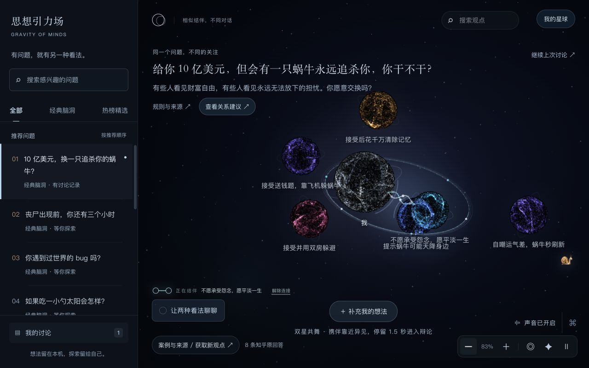
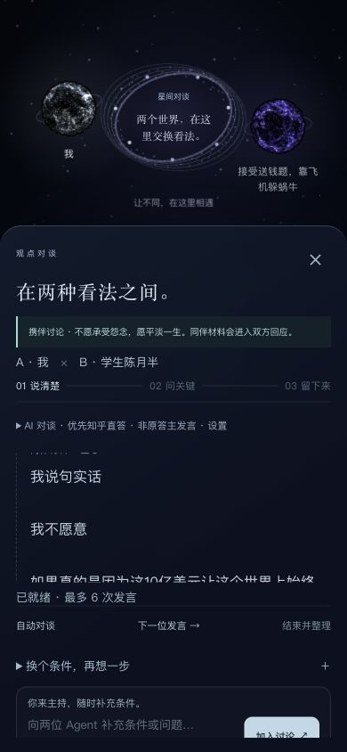

# 停留自动连接与辩论

本轮按用户要求替换关系确认流程：不弹关系卡片，不要求点击“连接”。这是同日[星球互动与讨论舞台](celestial-interactions-2026-09-12.md)之后的交互调整。

## 行为

- 拖动我的星球或同伴靠近另一颗星球，松手并停留 1.5 秒后，观点相近自动结伴，存在分歧直接打开辩论界面。等待时只有小进度环和文字。
- 再次拖动、离开范围、切换目标会重新计时。阅读、搜索、操作对话框和隐藏页面时不会触发；关闭辩论、解除连接或离开世界后，需要再次主动靠近。
- 停留期间暂缓会改变相遇位置的排斥与公转，避免松手后的位移不断重置计时。暂停视觉动画仍可以使用自动相遇。
- 阅读详情中的“靠近这颗星球”遵循同一延迟，锁定刚读的目标，避免密集区域误选邻居。仍可用键盘靠近。
- 连接后的状态使用简洁文字，不再有卡片外框。原回答阅读界面与讨论记录保留。

## 关系与数据

关系优先使用用户已有纠正，其次使用 AI 对当前原文的分析；距离只选择相遇对象，不判断观点含义。分析尚未完成时显示“正在比较观点”，信息不足时提示补充，无关观点不自动连接或辩论。可在详情折叠区纠正判断，正常流程不需要展开。

前端按每批最多 6 条调用既有分析接口，覆盖画布上最多 8 条材料。兼容旧的 6 条分析缓存，首次靠近未覆盖观点时补齐；失败不会逐帧重试，修改观点、切换话题或取消后不会应用过期响应。自动连接和恢复连接不会把 AI 判断写成用户纠正。

## 验收

- `npm --prefix web test`：94/94 通过。覆盖精确延迟、拖动取消、目标变化、关闭后不重开、未知关系、同伴保留、停留位置稳定、读取目标锁定、缓存兼容、批量分析及异步取消。
- 修改过的 JavaScript 通过语法检查，`git diff --check` 通过。
- Codex 内置浏览器，独立本地 `8084` 来源：使用明确拒绝蜗牛追杀条件的测试观点，真实 AI 成功比较全部 8 条材料；实际拖动后自动连接相近观点，携伴靠近分歧后直接打开辩论并保留同伴。
- 再次拖走取消、关闭讨论后不原地重开、刷新恢复已有连接均通过。390×844 小屏验证暂停动画下仍能进入辩论，无横向溢出；未知观点只显示信息不足提示。
- 没有使用用户 Edge 的 `8082` 存储做测试。本轮验证了真实关系分析和辩论打开流程，没有额外测试实时 Agent 发言质量；小屏是浏览器视口验收，非实体手机测试。

本地预览：<http://127.0.0.1:8082/#/world/snail>，刷新加载更新。未提交或部署到公网。

