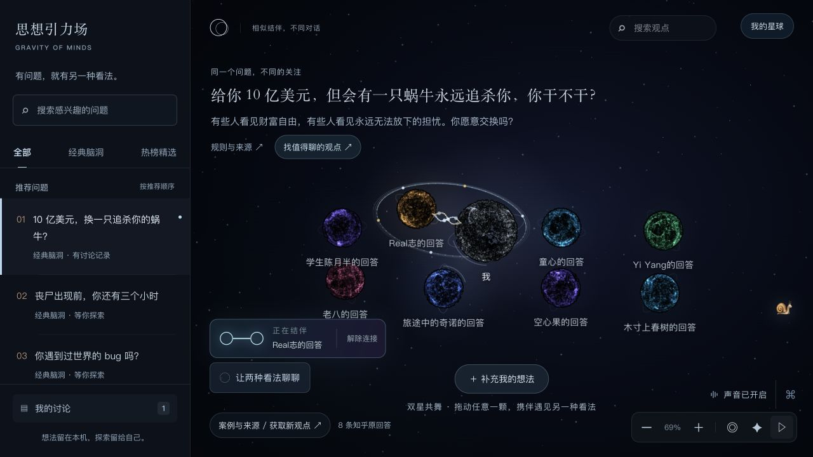
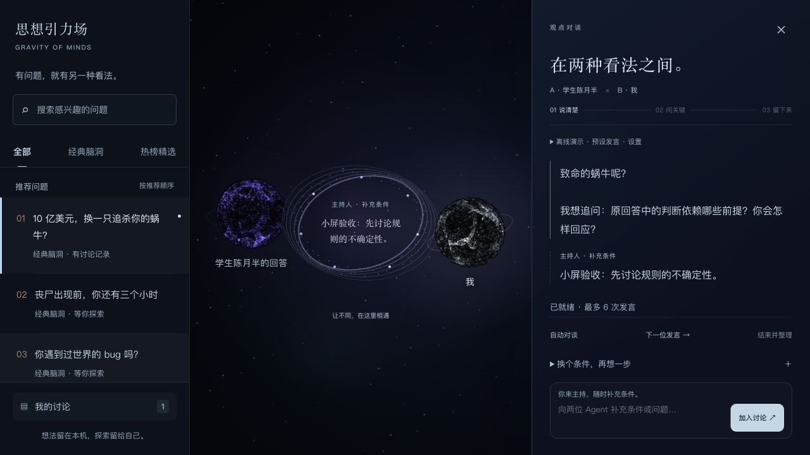
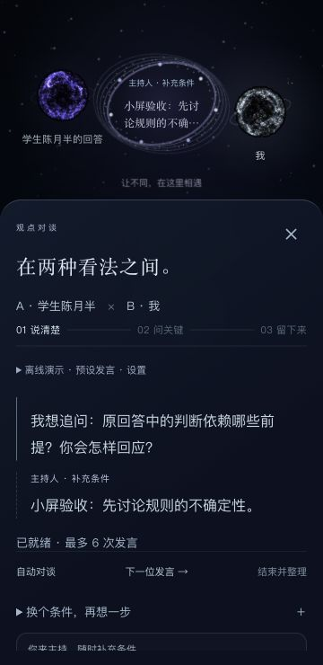

# 星球互动与讨论舞台

日期：2026-09-12。本次在现有原生 JavaScript / WebGL 前端落实双星共舞、引力交锋、星间之门，以及公共画布入场。

后续调整：关系选择卡片已替换为停留 1.5 秒自动相遇，详见[最新交互与验收](automatic-encounters-2026-09-12.md)。以下保留本轮初次动效验收记录。

## 已实现

- 结伴后先聚拢，再形成有前后遮挡的共享轨道、双色能量流与星尘涟漪。拖动任一星球会带动同伴；读取观点或暂停时停止自动公转。结伴落点优先选择附近空位。
- 用户确认分歧后，靠近时出现压缩力场、球面形变、极光界面与回弹；向内拖动有阻力，松手后出现讨论入口。关系判断仍由用户确认或已有关系状态决定，距离不表示赞同或反对。
- 打开讨论时，两个参与星球移至传送门两侧。桌面使用右侧讨论面板，小屏使用底部面板。回复成功返回后才出现发言光流；主持人补充使用金色光流，中央展示实际发言的短摘录，完整内容保留在讨论记录。
- 保存成功后，金色结晶从讨论舞台飞向“我的星球”。刷新后可回看已保存记录。存储失败沿用既有错误状态，不显示保存成功动效。
- 公共画布增加约 2.15 秒的纵深入场，可用按钮、点击或键盘立即跳过，也可通过画布控制中的星形按钮重看。减少动态效果、暂停、离开页面会结束瞬态效果。

## 实现与边界

`celestial-scene.js` 统一维护两层 Canvas、一个时钟和有上限的涟漪/光流列表；`orbital-motion.js` 提供轨道、力场、落点与响应式舞台几何；WebGL 球体只增加压力外观参数。讨论投影不改写原画布位置，退出时恢复镜头，跨手机断点则重新适配画布。

背景星尘为 180 个，低画质为 72 个，涟漪最多 5 组，发言光流最多 8 组；没有提高原有 WebGL 粒子预算。这些是数量边界，不是帧率测试结果。没有实现传播语义关系的全图重排。

## 验收

- `npm --prefix web test`：83/83 通过。覆盖不同帧率下轨道中心和距离约束、暂停、空位落点、单向拖动阻力、响应式传送门、减少动态效果、连续触发的生命周期上限，以及既有来源、存储、对谈逻辑。
- Python `unittest`（`web/tests/test_*.py`）：26/26 通过。
- `node --check` 与 `git diff --check` 通过。
- Codex 内置浏览器：1280×720、390×844、360×740。完成输入观点、确认结伴、实际拖动、确认分歧、进入讨论、离线发言、主持人补充、结束整理、保存、首次回看及刷新后记录仍存在。
- 暂停前后读取所有 9 个星球的 DOM 投影，位置保持相同；重看入场后可立即跳过；快速关闭/恢复讨论没有遗留传送门文案。
- 在讨论中从桌面切至 360×740 后退出，9 个星球均恢复为可见目标；小屏无横向溢出，讨论正文最小高度 145px，补充表单可滚动操作。
- 验收期间修复了输入阶段局部变量遮蔽导致的绘制异常、背景覆盖共享轨道后半环、隐藏目的地导致结晶飞向页面原点、暂停时仍发生分离位移及跨断点的镜头恢复问题。最终验收没有新增浏览器错误。

浏览器交互测试在独立的本地 8084 来源进行，禁用外部凭证；测试记录未写入交付用 8082 来源。对谈验收使用明确标注的离线演示，没有验证本次实时模型回复质量。窄屏验收为视口测试，未测试真实手机 GPU 或触摸手势。

## 预览

本地入口：<http://127.0.0.1:8082/#/world/snail>。在仓库根目录运行 `python3 web/server.py --port 8082`，未发布到公网。

