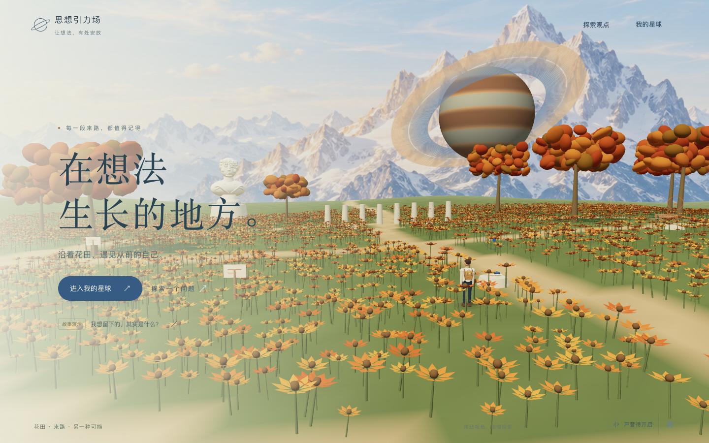
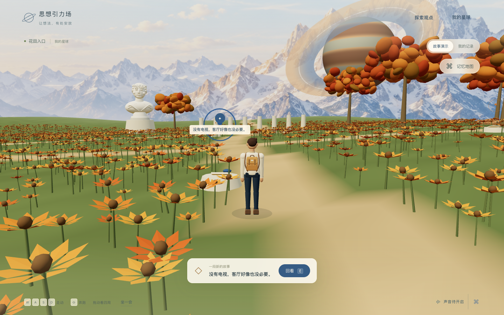
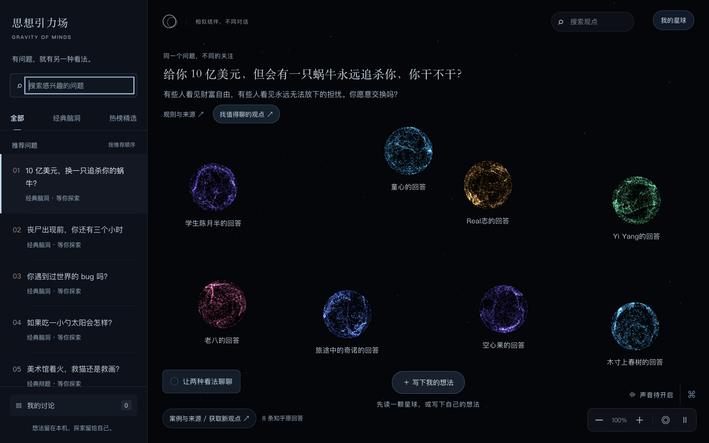
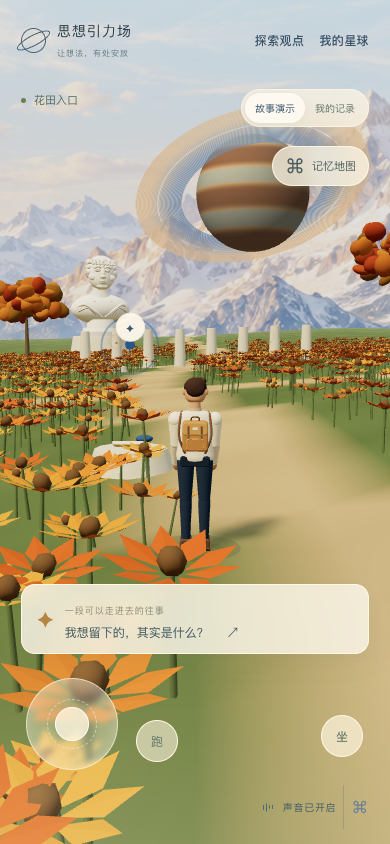

# 思想引力场：可漫游的记忆星球

2026-09-11。实现位于 `web/`；原交付包和此前验收报告保留。当前为本机预览。

## 打开体验

入口：<http://127.0.0.1:8085/#/home>。

```sh
python3 -B web/server.py --port 8085
```

桌面使用 WASD / 方向键移动，Shift 奔跑，拖动空白处看四周，点击地面自动走近。靠近物件只显示预览，点击“回看”或按 E 阅读。手机提供摇杆、奔跑切换与右侧拖动镜头。记忆地图支持定位、搜索和列表；声音与画面设置支持自动、丰富和轻盈画质。

## 已实现

- 雪山、巨大行星、雕塑与暖色花田。远景为原创生成图，近景地形、植物、角色与记忆物件为三维几何。
- 原创 GLB 人类旅人，浅色外套与背包，包含站立、行走、奔跑、坐下和阅读五种动画；补齐边界、树干、长椅、石柱碰撞与镜头避障。
- 首次约两秒、可跳过的入场；恢复位置与镜头；脚步和阅读与环境声音联动，阅读时停止移动与镜头漂移。
- 六段演示往事与客厅主线：读选观点球、四轮对谈、两种生活前提、三个可编辑结尾。新物件在稳定位置出现，附近植物轻轻展开。
- 大量个人历史按稳定空间分组，展开后仍可找到全部记录；保留原历史详情、来源快照和导出。
- “知识星球”按用户确认恢复深色宇宙、彩色粒子球、桌面常驻话题栏与左下独立关系提示卡。暖色场景仅用于首页和“我的星球”；完整原文、结伴、分歧、对谈和保存回访继续可用。
- 修复声音按钮遮挡输入入口、窄屏恢复桌面相机裁切、全文切换滚动残留，以及从旧记忆进入主线后刷新回到旧记录的问题。

## 双星球视觉分离（2026-09-12）

本次修改仅将公共知识星球恢复为原深色视觉；个人星球继续使用暖色三维漫游场景。

- 知识星球：深色背景与稀疏星空、彩色粒子球、围绕中心的疏朗布局、桌面固定话题栏、独立关系卡。手机话题栏使用抽屉。
- 我的星球：保留花田、人物、地图、故事与真实历史；导航明确使用“知识星球”和“我的星球”。
- 恢复粒子桥和分歧波纹。悬浮原文卡保留翻页、完整正文与来源；关系卡操作期间固定其对应观点，拖动球体不再选中页面文字。
- 76 项 JavaScript 测试通过。浏览器实测输入成球、结伴、解除、约 58 像素的排斥位移；四轮离线发言、补充条件、保存、刷新及个人历史读回通过。
- 个人世界走动、切换后位置恢复、七处故事入口与故事阅读通过；390 × 844 视口检查了话题抽屉、搜索切换、原文翻页、滚动与配图。
- 测试使用独立存储前缀，保留用户个人历史。下方性能与完整故事分支结果属于 9 月 11 日验收，本次没有重新测量性能或真实手机。

## 存储与内容

| 内容 | 存储 | 处理方式 |
| --- | --- | --- |
| 原有个人观点、讨论、来源快照 | `gravity.sessions.v1` | 沿用原结构、详情与导出 |
| 故事节点、条件、结尾、便签 | `gravity.story.v1` | 独立保存，演示重置只处理此项 |
| 角色位置、镜头、记忆空间 | `gravity.wander.v1` | 独立保存 |

六段往事和角色发言来自脚本，界面常驻“故事演示”标记。本次选择和便签真正写入浏览器存储，刷新可继续。脚本角色不借用真实答主身份；知乎原回答保留真实作者与原文链接。故事无需模型请求；公共实时服务沿用原配置和明确的离线演示选择。

## 验收结果

| 检查 | 结果 |
| --- | --- |
| JavaScript | 74 项通过，覆盖移动、碰撞、树干旁的可达点击、路由、稳定位置、1,200 条记录分组、两条件乘三结局、存储失败和重置隔离 |
| Python | 26 项通过，包含 GLB 目录范围、路径穿越、二进制头和 MIME 类型 |
| 桌面移动 | 真实键盘走跑，奔跑约 3.58 米/秒；点击行走、拖镜头和坐姿已检查；地图打开后位置停止 |
| 手机触摸 | 390 × 844 视口，实际 touch 事件驱动摇杆，步行约 2.03 米/秒 |
| 减少动态效果 | 实测环境时间停止，阅读时位置不变 |
| 无 WebGL | 禁用 WebGL 后，经列表完成读选、对谈、条件与结尾选择、编辑、刷新、保存、回访、重置 |
| 演示隔离 | 完整故事流程前后个人存储字节一致，模型请求计数为 0 |
| 公共关系 | 输入成球、结伴、共同移动、解除、分歧与排斥均在浏览器走通 |
| 公共讨论 | 四次离线发言、补充条件、保存；从个人记忆地图读回刚才的记录 |
| 原回答 | 9 个话题、34 条原回答逐一核对正文开头和结尾、作者、来源、翻页与滚动复位 |
| 声音 | 三种关系音效有实际输出、样本有效、尾音正常收束；交互事件到达音频引擎 |

浏览器验收使用独立测试前缀，测试数据保留，没有清理用户历史。

### 性能和实际限制

GPU 报告为 Apple M5 / ANGLE Metal。1440 × 900 桌面实测约 **29.1 FPS**，P95 帧时约 42 ms；390 × 844 手机视口约 **29.2 FPS**，P95 约 42 ms。自动画质降低花草密度并关闭投射阴影，核心操作保留。

**桌面稳定 60 FPS 目标尚未达到；手机仅完成浏览器视口与触摸模拟，未进行真实手机性能验收。** 五分钟主线为设计目标，尚未进行多人计时测试。

当前角色采用风格化几何和刚性关节动画，移动范围为一张小地图。

## 主要文件

- `web/wander-controller.js`：移动、边界、碰撞、寻路、记忆位置与分组。
- `web/wander-world.js`：三维景观、角色、动作、物件和相机。
- `web/wander-ui.js` / `web/wander.css`：漫游界面、触摸、地图、列表与历史适配。
- `web/story.js` / `web/story-ui.js` / `web/story.css`：分支、独立持久化与阅读界面。
- `web/cosmos.js`、`web/world-particles.js`、`web/knowledge.css`：共用渲染器、深色粒子观点球与知识星球。
- `web/assets/planet/daylight/`：原创 GLB、远景图、生成器与模型验证报告。
- `web/tests/wander.browser.mjs`：无 WebGL 的完整故事浏览器验收。

## 画面










