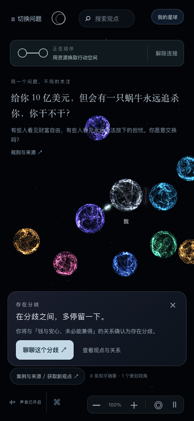

# 星球连接与排斥的动效、音效

本地实现：`web/`，2026-09-11。

## 交互表现

- 连接：两端光束汇聚、球壳泛起共鸣环；结伴期间，双向粒子沿光桥流动并跟随星球位置。音效为依次进入的开放和弦。
- 解除连接：光桥散成两束粒子，回到各自星球；伴随短促下行音。快速断开会替换尚未结束的连接动效。
- 排斥：实际接触时产生局部压力弧、微光和球壳脉冲；伴随下滑低频与柔和气流。持续接触只触发一次，拉开后才重新触发；音频额外设置 700 ms 间隔。
- 遵循现有总音量、交互音量、静音和减少动态设置。第一次真实点击或触摸唤醒音频，唤醒尚未完成时最多等待 600 ms；离开路由后不会补播。
- 恢复保存的连接不重放连接音；输入、切换话题或离开公共世界会清除短暂动效。切到后台停止短音，避免返回后播放旧音。
- 手机关系卡显示时暂时收起与其重叠的写想法、Agent 和彩蛋按钮；关闭关系卡后恢复。声音控件位于左下角，缩放控件位于右下角。

音效通过现有 Web Audio 引擎在本地合成，无外部音频文件。视觉反馈使用现有连接 Canvas 和粒子渲染器，关系判断与排斥物理逻辑保持独立。

## 验收记录

- `npm --prefix web test`：30 / 30 通过，包括接触去重、拉开重触发、被动布局不发声、减少动态、动效生命周期和快速断开。
- 桌面浏览器 1200 × 800：实际拖动连接、跟随、断开和排斥通过；三种音效均在运行的 AudioContext 中触发，无页面异常。
- 手机浏览器视口 390 × 844、DPR 2，使用触摸事件：光桥 1,755 个非透明像素；排斥目标移动约 33 CSS px；连接、断开、排斥动效分别在 24、23、23 帧中绘制，三种音效均触发。此为触摸模拟，非实体手机验收。
- Web Audio 离线渲染三种生产音效：峰值约 0.035、0.023、0.038，均有有效信号，无非有限采样或削波，尾部归零，全部短音节点释放；即时重复触发被拒绝。
- 静音时连接和解除仍可用，未新增声音事件；减少动态时保留连接和声音，瞬时动效为空；返回公共页面恢复连接未重复发声。
- 实际暂停 AudioContext 后点击解除连接：自动恢复并播放一次，覆盖手机初次唤醒可能漏音的问题。

浏览器脚本：`web/tests/planet-interactions.browser.mjs` 和 `web/tests/relationship-audio.browser.mjs`。测试使用独立存储前缀；诊断只读取效果种类、音频状态和计数。

